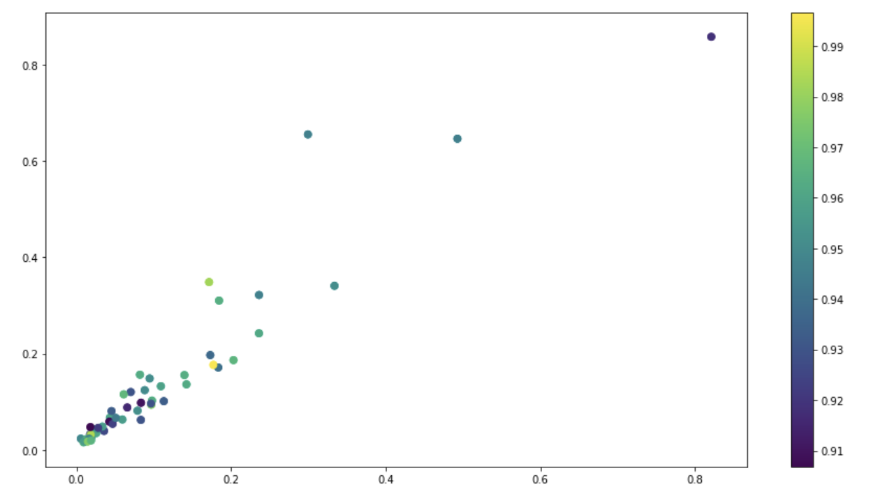

# Return on Financial Investment in American Public School Systems
##### Chase Yarbrough, Jinyoung Eum, and Ved Mohan

### Introduction
Education is a pillar of society that factors into decisions with a variety of scopes with both short term and long term implications. A strong public education system has resounding implications ranging from which district families chose to settle in, adjacent property valuations, and larger more abstract relationships such as the financial growth of countries in the long run.

### Motivation
Given a limited amount of funding each year, state and federal administrations are tasked with investing in various aspects of public education in order to improve the overall quality of learning.
Our goal was to create a tool which demonstrates which areas to target spending and investments in order to receive the highest return on education quality.

### Problem Statement
**X dollars invested in Y area will result in an average increase in educational performance by Z.**

### Data
Two different sources of data were used, testing data and financial data

#### Test Data
Test score data from  National Assessment of Educational Progress (NAEP testing). NAEP has been selected as it is a standardized test administered at two grade levels, 4th grade and 8th grade. There are two different scores, measuring Math and English performance.

Some characteristics of this data:
1. Test scores are available biyearly in each state from 2007 to 2017.
2. Tests were given to 4th and 8th graders in Math and Reading and the average score by state is used.
3. For 8th graders the average math test score is 282 and the average reading test score is 265.
4. For 4th graders the average math test score is 240 and the average reading test score is 221.

4th Grade and 8th Grade Math and Reading Data were combined to create an *Overall Average Test Score* Column.

[Dataset source](https://nces.ed.gov/nationsreportcard/)

#### Financial Data
Financial data was sourced from the United States Census. Data between 2008 and 2017 tracked individual areas of investment on a state by state basis. The categories were as follows:

* Salaries and Wages
* Employee Benefits
* Pupil Support Services
* Staff Support Services
* General Administration
* School Administration
* Operation and Maintenance of plant
* Pupil Transportation
* Other

[Dataset source](https://www.census.gov/data/tables/2008/econ/school-finances/secondary-education-finance.html)

Below is a snapshot of both financial data and test data compiled into a singular dataframe

Each row corresponds to a state and a year between 2007 and 2017. The shape of the the dataframe is (250, 15).

#### Dividing Further into the Dataset
Plotting Overall Score Average over the Years 2007-2017

Score average is slightly skewed, but loosely follows a gaussian distribution. This allowed us to continue without applying a normalization transformation such as Box-Cox. However, due to the order of magnitude difference between factors, columns were normalized relative to themselves.

### Procedure
We intend to perform a linear regression on aspects of each school system’s financing as well as the past year’s test scores against the current test scores to give an overall predictive formula for the change in a school’s performance based on differences in a state’s financial plan.

A preliminary check was done using a **Pearson Correlation** test. This checked the individual correlations between All Financial Investment Areas and Overall Score Average

Highest correlation is Per Pupil Instructional Spending at 0.38. This seems reasonable: increasing spending per capita would positively affect performance. However, Pearson Correlation does not account for the impact of the variables combined. 

#### Supervised

In order to build on the preliminary exploration, a **Multiple Regression** model was created. Test and training data were split 20:80 respectively. 

Model Performance:

* Mean Absolute Error: 0.0151
* Mean Squared Error: 0.0003
* Root Mean Squared Error: 0.0176

A sampling of the model performance (blue) versus actual data (orange)

A summary of the coefficients returned:

It is apparent that when all areas of investment are considered together the following were most influential:

* **Per Pupil Instructional Spending** (+0.364695)
* **PP&E** (+0.194763)
* **Instructional Spending** (-0.411845)
* **Per Pupil Support System Spending** (-0.226041)

These factors represent the two strongest correlations in the positive and negative directions. 
**Ridge regression** shrinks the coefficients, reducing the model complexity and multi-collinearity. This allows us to cross check influential factors with Multiple Regression

Ridge Regression was performed at two alpha levels, where a higher α value typically corresponds to more restriction on the coefficients and a low α corresponds to more generalization.

Model Performance:
* Ridge Regression Train Score with low alpha: 0.46036
* Ridge Regression Test Score with high alpha: 0.11272
* Ridge Regression Train Score with low alpha: 0.02249
* Ridge Regression Test Score with high alpha: 0.01770

We see that for coefficient indices Per Pupil Instructional Spending, Instructional Staff, PP&E the magnitudes are considerably less when compared to linear regression. Similarly indices Instructional Spending, Per Pupil Support Systems Spending, General Admin are considerably less than linear regression

Since these four variables seem extremely impacted over multiple iterations, they were carried forward for further analysis. 

Before unsupervised clustering techniques were applied to explore patterns between the states, a simple graph plot with clusters by Overall Test Score were made to gain some understanding of what to expect.

Visualizing the Multiple Regressions highest positive performing coefficients (Instructional Staff and PP&E). It is evident that there is no strong relation between higher spending in both areas and test score performance. Interestingly, there is a linear relationship between both coefficients.

#### Unsupervised
Due to lack of insight from simple graph clustering, **Gaussian Mixture Models** (GMM) were created on each of the four coefficients.

Texas & California are grouped apart. (Grey)

Texas, California, and New York are grouped apart from the rest of the states. (Orange)

Once again, in this model, Texas, California, and New York are grouped apart from the rest of the states. (Grey)

This model returned an even split across all states. Per Pupil Support Spending do not trend towards groups that are solely "small state versus large state" clusters. This further breaks from the pattern of the past three models as High and Low Overall Test Scores are evenly distrbuted across both groupings.

### Conclusion
We began with a simple Pearson Correlation Test to check for evidence of individual correlations between areas of investment and effect on Overall Average NAEP score. This was followed by a supervised Multiple Regression model, supplemented by Ridge Regression to find the 4 most influential factors across 50 states. After identifying these factors, GMM was applied to find meaningful clusters of states.

##### “No one size fits all”
It was evident that states with high population and that had high revenues were consistently grouped among themselves. This led us to the conclusion that further state specific analyses would be required. For example, the same change instructional spending can affect teachers in a large state such as California and Rhode Island quite differently. 

Therefore, there can be no definitive conclusion of the form: "*an increase in Per Pupil Instructional Spending will increase Overall Test Average by 0.364695.*"

#### Weaknesses
One important assumption that was made during this project was that increase in performance follows investment in education and not the other way around. In reality this is a simplfying assumption ignoring the fact that there will be a give and take between the two factors.

### Related
[Link to Code (Jupyter Notebook)](InvestinginPublicSchools.ipynb)

[Link to Video (YouTube)](https://youtu.be/8y3RL1CPSaU)

### Contributions

* Data Cleaning and Collection: Chase Yarbrough, Jinyoung Eum
* Pearson Coefficient: Ved Mohan
* Multiple Regression: Jinyoung Eum, Ved Mohan
* Ridge Regression: Ved Mohan
* GMM: Jinyoung Eum
* Video Presentation: Chase Yarbrough
* Website: Jinyoung Eum, Ved Mohan
* Website text: Chase Yarbrough, Ved Mohan 

This project was a team effort and all members believe each contributed equally to the finished product.

---
last updated 4/26/2020
